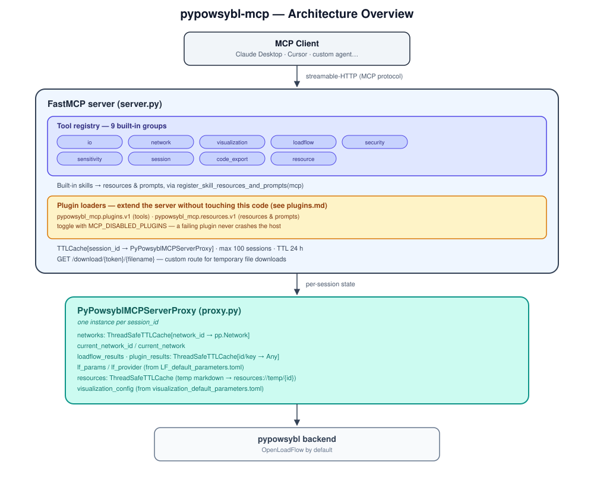

### Architecture Overview

This document describes the internal architecture of the PyPowsybl MCP server.

#### High-level picture



#### Key components

| Component                 | File                                             | Role                                                  |
|---------------------------|--------------------------------------------------|-------------------------------------------------------|
| `FastMCP` server          | `pypowsybl_mcp/server.py`                        | Entry point, tool registration, HTTP route            |
| `PyPowsyblMCPServerProxy` | `pypowsybl_mcp/proxy.py`                         | Per-session state container                           |
| Tool groups               | `pypowsybl_mcp/tools/`                           | Business logic, one class per domain                  |
| Plugin discovery          | `pypowsybl_mcp/plugins.py`                       | Entry-point scanning and loading for external plugins |
| Session utilities         | `pypowsybl_mcp/utils/user_session_management.py` | Session ID lifecycle                                  |
| Download utilities        | `pypowsybl_mcp/utils/download_utils.py`          | Temporary token-based file download                   |
| Admin HTTP API            | `pypowsybl_mcp/admin.py`                         | Read-only session/health reporting                    |
| Session registry          | `pypowsybl_mcp/utils/session_registry.py`        | Per-session bookkeeping behind the admin API          |
| LLM agents                | `pypowsybl_mcp/llm_utils/agents/`                | Optional code-generation agent                        |

#### Tool groups

| Group             | Module                         | Main responsibilities                                                      |
|-------------------|--------------------------------|----------------------------------------------------------------------------|
| **io**            | `tools/utils/io.py`            | Load networks from file or URL; export networks                            |
| **network**       | `tools/network_tools.py`       | Create IEEE networks; inspect, modify, and manage networks and variants    |
| **visualization** | `tools/utils/visualisation.py` | Single-line diagrams; network area diagrams                                |
| **loadflow**      | `tools/loadflow_tools.py`      | Run AC/DC load flow; manage load flow parameters                           |
| **security**      | `tools/security_tools.py`      | N-1 security analysis; contingency list generation                         |
| **sensitivity**   | `tools/sensitivity_tools.py`   | DC/AC sensitivity, PSDF, DCDF, PTDF analyses                               |
| **session**       | `tools/utils/session.py`       | Admin tools: set/duplicate session (token-protected)                       |
| **code_export**   | `tools/utils/code_export.py`   | Generate standalone Python scripts from session history                    |
| **resource**      | `tools/utils/resources.py`     | Fetch pypowsybl API documentation (`get_online_resource`, `read_resource`) |

#### Request lifecycle

```
MCP tool call
    │
    ├─ 1. FastMCP deserializes arguments and injects Context
    │
    ├─ 2. Tool handler calls get_session_id(ctx)
    │       └─ assigns a UUID to ctx.session.session_id if missing
    │
    ├─ 3. Tool handler calls self.get_proxy(session_id)
    │       └─ creates a new PyPowsyblMCPServerProxy if not in cache
    │       └─ stores it in pypowsybl_proxies[session_id]
    │
    ├─ 4. Business logic executes via the proxy
    │       └─ reads/writes proxy.networks, proxy.current_network, …
    │
    └─ 5. Returns a string result to the MCP client
```

Tools contributed by a plugin follow this exact same lifecycle — a plugin tool class also subclasses `PyPowsyblTool`
and is indistinguishable from a built-in one once loaded (see [Plugins](#plugins) below).

#### Transport

The server uses the **streamable-HTTP** MCP transport (not stdio). It listens on `0.0.0.0` at the port defined by
`MCP_PORT` (default `9992`). A custom `GET /download/{token}/{filename}` route serves temporary file downloads generated
by export or visualization tools.

#### Stateful vs stateless design

The server is **stateful**: loaded networks, load flow results, and parameters persist in memory for the lifetime of the
session proxy (up to 24 h of inactivity). This avoids re-sending large grid files on every tool call.

See [mcp_sessions.md](mcp_sessions.md) for the full session and TTL-cache design.

#### Plugins

The tool groups above are not the only way tools reach the registry. At startup, `pypowsybl_mcp/plugins.py` scans two
Python entry-point groups (`pypowsybl_mcp.plugins.v1` for tools, `pypowsybl_mcp.resources.v1` for resources/prompts)
and loads whatever it finds — any installed package can contribute this way, with no change to the core repo. A plugin
reads and writes the exact same `PyPowsyblMCPServerProxy` built-in tools use, and a failing plugin is logged and skipped
rather than crashing the server.

See [plugins.md](plugins.md) for how to use or write a plugin.

#### LLM code-generation agent

`pypowsybl_mcp/llm_utils/agents/code_generation.py` contains an optional OpenAI-Agents-based sub-agent that can generate
standalone `pypowsybl` Python scripts from a natural-language description. It is invoked by the
`generate_python_script` MCP tool and requires `OPENAI_API_KEY` / `OPENAI_BASE_URL` to be configured.
