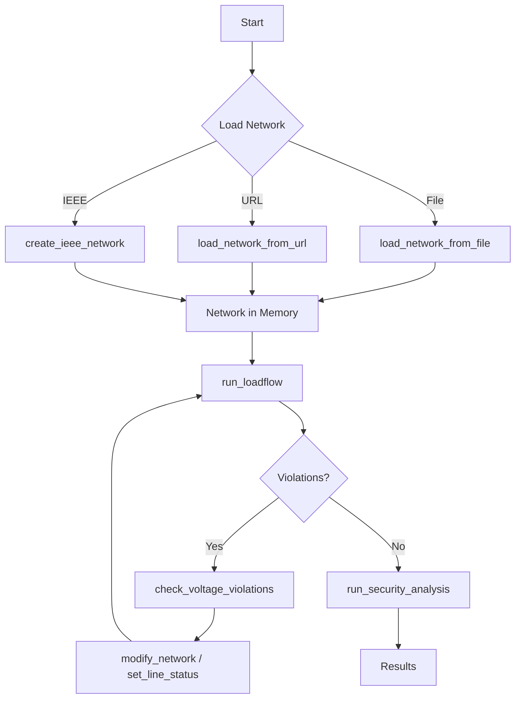

### Getting Started with PyPowsybl MCP Server

This guide walks you through installing, starting, and making your first power grid analysis with the PyPowsybl MCP
server.

---

#### Prerequisites

- Python 3.12 or later (3.13 recommended)
- [`uv`](https://github.com/astral-sh/uv) package manager
- An OpenAI-compatible API key (only required for the `generate_python_script` tool)
- Docker (optional, for containerized deployment)

---

#### Step 1 — Install the server

Clone the repository and create a virtual environment:

```bash
git clone https://github.com/powsybl/pypowsybl-mcp.git
cd pypowsybl-mcp

uv venv --python 3.13
source .venv/bin/activate
```

Install with the open-source pypowsybl backend:

```bash
uv pip install .
```

---

#### Step 2 — Configure environment variables

Copy the provided template and fill in your values:

```bash
cp .env.template .env
```

Minimal `.env` for a local setup:

```dotenv
MCP_PORT=9992
MCP_PUBLIC_ADDRESS=localhost

# Required only for the generate_python_script tool
OPENAI_API_KEY=sk-...
OPENAI_DEFAULT_MODEL=gpt-5.4
```

All variables are optional except `OPENAI_API_KEY` (needed only for code generation). `MCP_PORT` sets the server
port and defaults to `9992`. See [Configuration Reference](configuration.md) for the full list.

---

#### Step 3 — Start the server

**Local:**

```bash
uv run python -m pypowsybl_mcp.server
```

You should see log output confirming the server is listening on `http://localhost:<port>`, where `<port>` is the
value of `MCP_PORT` or `9992` if `MCP_PORT` is not set.

**Docker (alternative):**

```bash
docker compose up --build
```

Place grid files you want to load in the `./data` directory; they will be available inside the container at `/app/data`.

---

#### Step 4 — Connect an MCP client

Use the same port as `MCP_PORT` in your client URL. The examples below use the default port `9992`.

##### Codex

Add the following block to `~/.codex/config.toml` or `.codex/config.toml`:

```toml
[mcp_servers.pypowsybl]
url = "http://localhost:9992/mcp"
```

Restart Codex after saving the file.

##### Claude Desktop

Add the following block to your `claude_desktop_config.json`:

```json
{
  "mcpServers": {
    "pypowsybl": {
      "type": "streamable-http",
      "url": "http://localhost:9992/mcp"
    }
  }
}
```

Restart Claude Desktop. The PyPowsybl tools will appear in the tool list.

##### Cursor

Open **Settings → MCP** and add:

```json
{
  "pypowsybl": {
    "type": "streamable-http",
    "url": "http://localhost:9992/mcp"
  }
}
```

For more client options (custom Python agents, remote deployments) see
[MCP Client Integration](mcp_client_integration.md).

---

#### Step 5 — Run your first analysis

Once connected, ask your LLM client (Codex, Claude Desktop, Cursor, ...) in natural language. Here are a few starter
prompts:

**Load a built-in test network and run a load flow:**

> "Create an IEEE 14-bus network, run an AC load flow, and show me the results."

**Load a network from a file:**

> "Load the network from `/app/data/my_grid.xiidm` and list all generators."

**Check for voltage violations:**

> "Run a load flow on the current network and check for voltage violations."

**Generate a diagram:**

> "Show me a single-line diagram for substation `S1`."

**Security analysis:**

> "Create a contingency list for the current network and run an N-1 security analysis."

The LLM will automatically call the appropriate MCP tools in sequence. You do not need to invoke tools manually.

---

#### Quick reference: key tools

| What you want to do          | Tool called by the LLM                |
|------------------------------|---------------------------------------|
| Load a network from a file   | `load_network_from_file`              |
| Load a network from a URL    | `load_network_from_url`               |
| Create an IEEE test network  | `create_ieee_network`                 |
| Run AC/DC load flow          | `run_loadflow`                        |
| Check voltage violations     | `check_voltage_violations`            |
| Run N-1 security analysis    | `run_security_analysis`               |
| Find overloaded elements     | `get_overloaded_elements`             |
| Plot a single-line diagram   | `plot_substation_single_line_diagram` |
| Visualize the network area   | `visualize_network`                   |
| Export the network to a file | `export_network`                      |
| Generate a Python script     | `generate_python_script`              |

See [Tools Reference](tools_reference.md) for the complete catalog.

---

#### Troubleshooting

| Symptom                        | Likely cause                             | Fix                                                            |
|--------------------------------|------------------------------------------|----------------------------------------------------------------|
| Client cannot connect          | Server not running or wrong port         | Check the server log; verify `MCP_PORT` matches the client URL |
| Tools not visible in client    | Client not restarted after config change | Restart the MCP client                                         |
| `generate_python_script` fails | Missing or invalid `OPENAI_API_KEY`      | Set `OPENAI_API_KEY` in `.env`                                 |
| Network lost after reconnect   | New MCP session = new server-side state  | Reload the network; see [Sessions & State](mcp_sessions.md)    |
| Large file load times out      | Network file is very large               | Increase `AI_TIMEOUT` in `.env`                                |

---

#### Next steps

- [Architecture Overview](architecture.md) — understand how the server is structured.
- [Configuration Reference](configuration.md) — tune load flow parameters, visualization, and cache limits.
- [Sessions & State](mcp_sessions.md) — learn how server-side state works and how to pin sessions.
- [Tools Reference](tools_reference.md) — full catalog of all 30+ MCP tools.

### Load flow provider

OpenLoadFlow is the default load flow provider.

The DynaFlow and Hades2 providers appear in the list returned by `get_loadflow_provider_info`, but they will not work
because the corresponding native modules are not installed on the host machine. These modules are Java/C++ libraries
that are only available internally. They must be installed separately.
If a provider is unavailable, the server returns an error such as `Module dynaflow not found`. In that case, you must
switch back to OpenLoadFlow using the `set_loadflow_provider` tool.

---

### Typical analysis workflow


