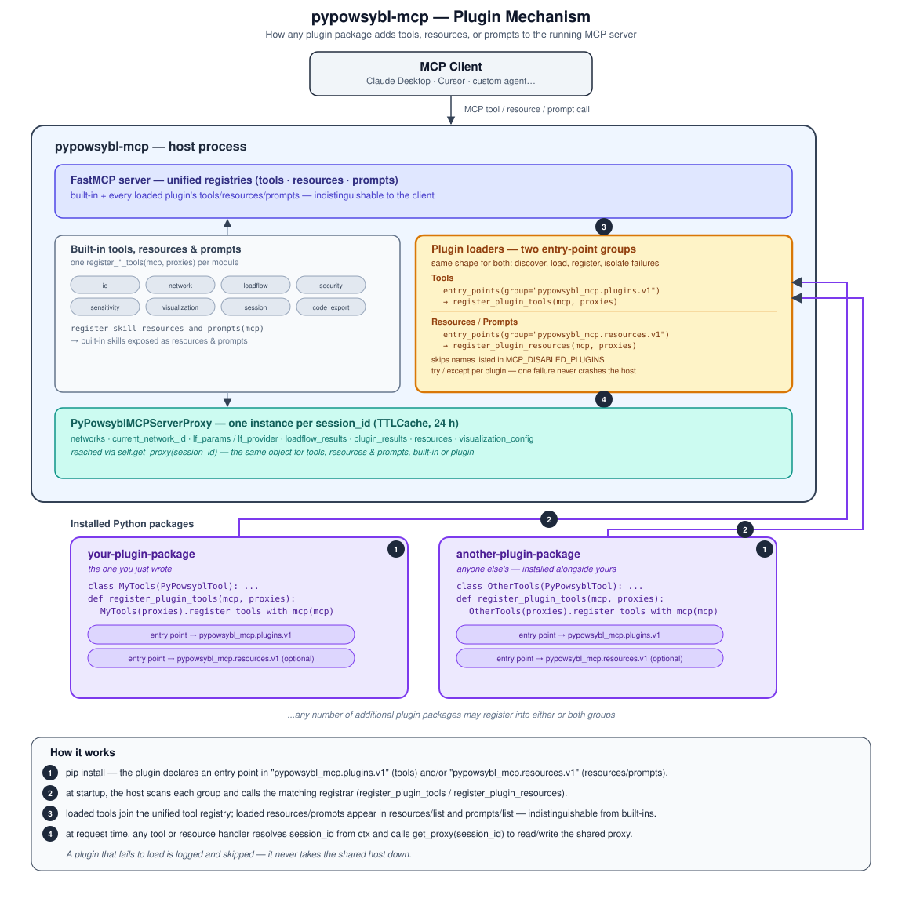

### Extending pypowsybl-mcp with Plugins

pypowsybl-mcp can be extended with additional tools, resources, and prompts - for a specific business use case, a niche
data format, a proprietary algorithm, an internal integration - without touching or forking the core project. This
document explains what a plugin is, how the mechanism works, how to use a plugin someone else published, and how to
write your own.

---

#### What is a plugin?

A plugin is a regular, independently-installable Python package that adds tools (and optionally resources/prompts)
to the running server. Installing it alongside `pypowsybl-mcp` - `pip install your-plugin-package` - is enough to
activate it. There is nothing to configure and no core code to change.

- Anyone can write one. There is no special or privileged plugin; every plugin, from anyone, follows the exact same
  mechanism.
- Any number of plugins can be installed side by side, from as many different authors as you like.
- A plugin's tools are indistinguishable from the server's own built-in tools once loaded - an LLM client sees one
  unified tool list.

---

#### Why use a plugin instead of contributing to the core?

- **Keep the core focused.** The built-in tool set stays a manageable, well-scoped set of general-purpose grid analysis
  tools instead of growing to cover every possible specialization.
- **Ship on your own schedule.** A plugin is versioned and released independently of `pypowsybl-mcp` itself.
- **Keep things private if you need to.** A plugin never has to be public - it can live in a private repository and a
  private package index, and still work exactly the same way once installed.
- **Bound the LLM's context window.** Tools you don't need don't have to be installed (or can be disabled - see below) -
  keeping the tool list an LLM sees as small as your deployment actually requires.

---

#### How it works

pypowsybl-mcp uses Python's standard plugin pattern: [
`importlib.metadata.entry_points`](https://docs.python.org/3/library/importlib.metadata.html#entry-points). The host
declares two entry-point groups; any installed package that registers an entry point in one of them gets discovered and
loaded automatically when the server starts.

| Group                        | For                 | Registrar signature                                         |
|:-----------------------------|:--------------------|:------------------------------------------------------------|
| `pypowsybl_mcp.plugins.v1`   | Tools               | `register_plugin_tools(mcp, pypowsybl_proxies) -> None`     |
| `pypowsybl_mcp.resources.v1` | Resources & prompts | `register_plugin_resources(mcp, pypowsybl_proxies) -> None` |

A plugin can declare either one, or both - they're independent.



A few things worth knowing about how this behaves in practice:

- **Discovery is automatic.** The host never imports a plugin package by name and never needs a registry file -
  `pip install`ing (or uninstalling) the package is the only "configuration" step.
- **Shared state.** A plugin tool reads and writes the exact same per-session state object the built-in tools use -
  there's no separate, thinner API to learn (see [Reference](#reference-what-a-plugin-can-rely-on) below).
- **A broken plugin can't take the server down.** Every plugin is loaded inside a try/except; a plugin that fails to
  load is logged and skipped, not fatal.
- **You can turn a plugin off without uninstalling it.** Set `MCP_DISABLED_PLUGINS` to a comma-separated list of
  entry-point names to skip at startup.

---

#### Using a plugin someone else published

```bash
uv pip install pypowsybl-mcp
uv pip install some-published-plugin-package

python -m pypowsybl_mcp.server
```

On startup, the server logs one line per plugin it found:

```
Loaded plugin 'some_plugin_name'.
Loaded resource/prompt plugin 'some_plugin_name'.
```

To disable a plugin without uninstalling it:

```bash
MCP_DISABLED_PLUGINS=some_plugin_name python -m pypowsybl_mcp.server
```

---

#### Writing your own plugin

##### 1. Scaffold the package

```
your-plugin-package/
├── pyproject.toml
└── your_plugin_package/
    ├── __init__.py
    ├── tools.py
    └── resources.py       # optional
```

##### 2. Write your tools

Subclass `PyPowsyblTool` and write one `async` method per tool. Its type hints and docstring *are* the tool's schema and
description for the LLM - there's nothing else to declare.

```python
# your_plugin_package/tools.py
from cachetools import TTLCache
from mcp import ServerSession
from mcp.server.fastmcp import Context, FastMCP

from pypowsybl_mcp.tools import PyPowsyblTool


class MyTools(PyPowsyblTool):
    async def ping(self, ctx: Context[ServerSession, None] = None) -> str:
        """Liveness check for this plugin."""
        return "pong from my-plugin"

    async def check_network_health(
        self,
        session_id: str,
        ctx: Context[ServerSession, None] = None,
    ) -> str:
        """Example custom analysis tool using the current network."""
        proxy = self.get_proxy(session_id)
        network_id = proxy.current_network_id
        if network_id is None or not proxy.has_network(network_id):
            return f"Error: no active network for session {session_id}."

        # ... your custom logic here ...
        result = {"network_id": network_id, "status": "ok"}
        proxy.set_plugin_result(f"mytools:{network_id}", result)
        return f"Health check completed for network '{network_id}'."

    async def get_network_health_result(
        self,
        session_id: str,
        ctx: Context[ServerSession, None] = None,
    ) -> str:
        """Retrieve the last cached result for the current network."""
        proxy = self.get_proxy(session_id)
        result = proxy.get_plugin_result(f"mytools:{proxy.current_network_id}")
        return str(result) if result is not None else "No result cached yet."


def register_plugin_tools(mcp: FastMCP, pypowsybl_proxies: TTLCache) -> None:
    MyTools(pypowsybl_proxies).register_tools_with_mcp(mcp)
```

If a helper method on your class shouldn't be exposed as a tool, exclude it explicitly - a leading underscore alone does
**not** exclude it:

```python
MyTools(pypowsybl_proxies).register_tools_with_mcp(mcp, exclude=["_some_helper"])
```

##### 3. (Optional) Add resources or prompts

Built with the same primitives the host uses for its own built-in resources - there is no separate plugin-only API.

```python
# your_plugin_package/resources.py
from pathlib import Path

from cachetools import TTLCache
from mcp.server.fastmcp import FastMCP
from mcp.server.fastmcp.prompts import Prompt
from mcp.server.fastmcp.resources import FileResource

GUIDE_PATH = Path(__file__).parent / "docs" / "guide.md"


def register_plugin_resources(mcp: FastMCP, pypowsybl_proxies: TTLCache) -> None:
    mcp.add_resource(
        FileResource(
            uri="myplugin://docs/guide",
            path=GUIDE_PATH.resolve(),
            name="my-plugin-guide",
            description="Usage guide for this plugin.",
            mime_type="text/markdown",
        )
    )
    mcp.add_prompt(
        Prompt.from_function(
            GUIDE_PATH.read_text,
            name="my-plugin-guide",
            description="Usage guide for this plugin.",
        )
    )
```

##### 4. Declare your entry points

```toml
# pyproject.toml
[project]
name = "your-plugin-package"
version = "0.1.0"
dependencies = [
    "pypowsybl-mcp>=0.6",
]

[project.entry-points."pypowsybl_mcp.plugins.v1"]
my_tools = "your_plugin_package.tools:register_plugin_tools"

[project.entry-points."pypowsybl_mcp.resources.v1"]
my_docs = "your_plugin_package.resources:register_plugin_resources"
```

Don't add `pypowsybl` to your own dependencies - the backend is provided by whatever environment your plugin gets
installed into.

##### 5. Install and verify

```bash
uv pip install -e /path/to/pypowsybl-mcp
uv pip install -e /path/to/your-plugin-package

python -m pypowsybl_mcp.server
```

You should see `Loaded plugin 'my_tools'.` (and `Loaded resource/prompt plugin 'my_docs'.` if you added one) in the
startup logs.

##### 6. Test your plugin

No live server needed - instantiate your tool class directly against a throwaway cache:

```python
from cachetools import TTLCache
from your_plugin_package.tools import MyTools


async def test_ping():
    tools = MyTools(TTLCache(maxsize=10, ttl=3600))
    assert await tools.ping() == "pong from my-plugin"
```

##### 7. Publish it

Publish the package wherever fits your needs - PyPI, a private index, or just a git URL. No change to the core
`pypowsybl-mcp` repository is required to ship a plugin, or a new version of one.

---

#### Reference: what a plugin can rely on

Your plugin reads and writes the same per-session state object (`PyPowsyblMCPServerProxy`) that built-in tools use,
obtained via `self.get_proxy(session_id)` (inherited from `PyPowsyblTool`). The following is the **committed, stable**
subset you can depend on across host versions:

- `get_network(network_id)`, `set_network(network_id, network)`, `has_network(network_id)`, `network_ids()`
- `current_network_id`, `current_network`
- `lf_params`, `lf_provider`
- `get_plugin_result(key)`, `set_plugin_result(key, value)` - a cache dedicated to plugins, separate from the host's own
  internal results, so your plugin can never collide with the host's or another plugin's data for the same key.
  Namespace your own keys (e.g. `f"mytools:{network_id}"`) the same way you namespace your tool names.

A few practical notes:

- **`session_id` isn't guaranteed to be a `str`** - treat it as an opaque, hashable value rather than assuming
  `isinstance(session_id, str)`.
- **Your tool class is instantiated once**, and that single instance serves every session and every concurrent request.
  Never cache per-request or per-session data as an attribute on `self` - anything that needs to persist belongs in the
  proxy above.
- **Namespace your tool names and entry-point keys.** If two plugins (or a plugin and the host) register the same
  tool/resource/prompt name, the first one loaded silently wins - there's no error. Prefixing your names (e.g.
  `mytools_check_health` instead of `check_health`) avoids this entirely.

