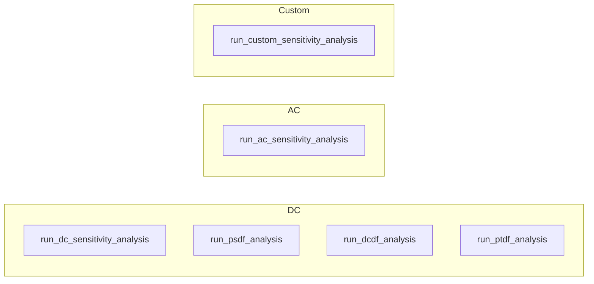

### Tools Reference

This document lists all MCP tools exposed by the PyPowsybl MCP server, grouped by category.

---

#### I/O tools

| Tool                     | Description                                                                                                    |
|--------------------------|----------------------------------------------------------------------------------------------------------------|
| `load_network_from_file` | Load a power network from a local file path (XIIDM, Matpower, CGMES, …).                                       |
| `load_network_from_url`  | Download and load a network from a remote URL (SSL verification is configured globally with `MCP_VERIFY_SSL`). |
| `export_network`         | Export the current (or a named) network to a file; returns a temporary download link.                          |

---

#### Network tools

##### Network lifecycle

| Tool                  | Description                                                                     |
|-----------------------|---------------------------------------------------------------------------------|
| `create_ieee_network` | Create a standard IEEE test network (IEEE14, IEEE30, IEEE57, IEEE118, IEEE300). |
| `list_networks`       | List all networks currently loaded in the session.                              |
| `switch_network`      | Set a loaded network as the active one for subsequent operations.               |
| `remove_network`      | Remove a network from the session cache.                                        |
| `get_network_info`    | Return metadata about the current (or a named) network.                         |

##### Network inspection

| Tool                                 | Description                                                                 |
|--------------------------------------|-----------------------------------------------------------------------------|
| `get_network_element_data`           | Return tabular data for a given element type (buses, lines, generators, …); pass `get_only_ids=True` for just the element IDs. |
| `get_top_active_power_transit_lines` | Return the lines with the highest active power transit.                     |
| `check_voltage_violations`           | List buses whose voltage is outside acceptable bounds.                      |

##### Network modification

| Tool                 | Description                                                                       |
|----------------------|-----------------------------------------------------------------------------------|
| `modify_network`     | Change parameters (P, Q, target voltage, …) of one or more network elements.      |
| `set_line_status`    | Connect or disconnect a branch (line or transformer).                             |
| `set_switch_status`  | Open or close a switch in the network (breaker, disconnector, load-break switch). |
| `set_tap_position`   | Move a transformer's ratio or phase tap changer to a new position.                |

##### Variants

| Tool                  | Description                                         |
|-----------------------|-----------------------------------------------------|
| `clone_variant`       | Clone the current variant into a new named variant. |
| `set_working_variant` | Switch the active variant.                          |
| `get_working_variant` | Return the name of the currently active variant.    |
| `list_variants`       | List all variants of the current network.           |
| `remove_variant`      | Delete a named variant.                             |

---

#### Visualization tools

| Tool                                  | Description                                                                     |
|---------------------------------------|---------------------------------------------------------------------------------|
| `plot_substation_single_line_diagram` | Generate a single-line diagram (SLD) for a substation; returns a download link. |
| `visualize_network`                   | Generate a network area diagram; returns a download link.                       |

---

#### Load flow tools

| Tool                             | Description                                                                                                |
|----------------------------------|------------------------------------------------------------------------------------------------------------|
| `run_loadflow`                   | Run an AC or DC load flow on the current network.                                                          |
| `get_loadflow_params`            | Return the current load flow parameters.                                                                   |
| `update_loadflow_params`         | Update one or more load flow parameters for the session.                                                   |
| `restore_default_loadflow_param` | Reset load flow parameters to the values in `LF_default_parameters.toml`.                                  |
| `get_loadflow_provider_info`     | List all available load flow providers, the system default, and the provider active in the session.        |
| `set_loadflow_provider`          | Switch the load flow provider for the current session; pass an empty string to restore the system default. |

---

#### Security analysis tools

| Tool                        | Description                                                                  |
|-----------------------------|------------------------------------------------------------------------------|
| `run_security_analysis`     | Run N-1 (or N-k) security analysis using a contingency list.                 |
| `create_contingencies_list` | Automatically generate a contingency list from the current network topology. |
| `get_overloaded_elements`   | Find elements above a loading threshold in normal (N) or N-1 operation.      |

---

#### Sensitivity analysis tools

| Tool                              | Description                                                                       |
|-----------------------------------|-----------------------------------------------------------------------------------|
| `run_dc_sensitivity_analysis`     | DC sensitivity of branch flows to injections or PST angles.                       |
| `run_ac_sensitivity_analysis`     | AC sensitivity of branch flows or bus voltages to injections or transformer taps. |
| `run_psdf_analysis`               | Phase-Shifter Distribution Factors for all branches.                              |
| `run_dcdf_analysis`               | DC Distribution Factors for a set of branches and injections.                     |
| `run_ptdf_analysis`               | Power Transfer Distribution Factors between bidding zones.                        |
| `run_custom_sensitivity_analysis` | Run a fully custom sensitivity analysis with user-defined factors.                |

---

#### Session tools *(admin, token-protected)*

| Tool                    | Description                                                                  |
|-------------------------|------------------------------------------------------------------------------|
| `get_pypowsybl_version` | Get the version of the pypowsybl library being used by the MCP server.       |
| `set_session_id`        | Override the session ID for the current MCP connection.                      |
| `duplicate_session`     | Deep-copy the proxy state from one session to another (fork a conversation). |

These tools (except `get_pypowsybl_version`) are protected by `MCP_AUTH_TOKEN` and **must never be called directly by an
LLM**.

---

#### Code export tools

| Tool                     | Description                                                                                                                                            |
|--------------------------|--------------------------------------------------------------------------------------------------------------------------------------------------------|
| `generate_python_script` | Generate a standalone `pypowsybl` Python script reproducing the operations performed in the session. Uses an LLM sub-agent; requires `OPENAI_API_KEY`. |

---

#### Resource tools

| Tool                  | Description                                                                                                |
|-----------------------|-------------------------------------------------------------------------------------------------------------|
| `get_online_resource` | Fetch `pypowsybl` API reference documentation (from readthedocs) for a class or method; caches it server-side. |
| `read_resource`       | Read back a documentation page already fetched this session with `get_online_resource`, from the cache.   |

---

#### Notes

- All tools return a **string** (plain text or JSON-formatted text).
- Tools that produce files (diagrams, exports) return a **temporary download URL** of the form
  `http://<MCP_PUBLIC_ADDRESS>:<MCP_PORT>/download/<token>/<filename>`.
- The `ctx` parameter is injected automatically by FastMCP and must not be passed by the caller.
- This page lists the server's **built-in** tools only. Installed plugins can add further tools that appear
  alongside these in the same tool list — see [plugins.md](plugins.md).
