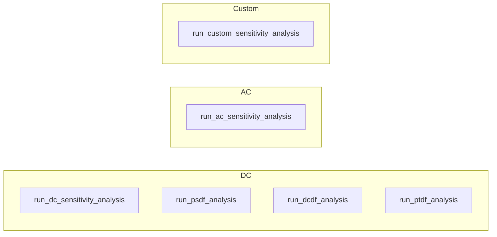

### Tools Reference

This document lists all MCP tools exposed by the PyPowsybl MCP server, grouped by category.

---

#### I/O tools

| Tool                     | Description                                                                                                    |
|--------------------------|----------------------------------------------------------------------------------------------------------------|
| `load_network_from_file` | Load a power network from a local file path (XIIDM, Matpower, CGMES, …).                                       |
| `load_network_from_url`  | Download and load a network from a remote URL (SSL verification is configured globally with `MCP_VERIFY_SSL`). |
| `export_network`         | Export the current (or a named) network to a file; returns a temporary download link.                          |

---

#### Network tools

##### Network lifecycle

| Tool                  | Description                                                                     |
|-----------------------|---------------------------------------------------------------------------------|
| `create_ieee_network` | Create a standard IEEE test network (IEEE14, IEEE30, IEEE57, IEEE118, IEEE300). |
| `list_networks`       | List all networks currently loaded in the session.                              |
| `switch_network`      | Set a loaded network as the active one for subsequent operations.               |
| `remove_network`      | Remove a network from the session cache.                                        |
| `get_network_info`    | Return metadata about the current (or a named) network.                         |

##### Network inspection

| Tool                                 | Description                                                                 |
|--------------------------------------|-----------------------------------------------------------------------------|
| `get_network_element_data`           | Return tabular data for a given element type (buses, lines, generators, …); pass `get_only_ids=True` for just the element IDs. |
| `get_top_active_power_transit_lines` | Return the lines with the highest active power transit.                     |
| `check_voltage_violations`           | List buses whose voltage is outside acceptable bounds.                      |

##### Network modification

| Tool                 | Description                                                                       |
|----------------------|-----------------------------------------------------------------------------------|
| `modify_network`     | Change parameters (P, Q, target voltage, …) of one or more network elements.      |
| `set_line_status`    | Connect or disconnect a branch (line or transformer).                             |
| `set_switch_status`  | Open or close a switch in the network (breaker, disconnector, load-break switch). |
| `set_tap_position`   | Move a transformer's ratio or phase tap changer to a new position.                |

##### Network extension (element creation)

| Tool                   | Description                                                                                              |
|------------------------|----------------------------------------------------------------------------------------------------------|
| `create_substation`    | Create a new substation (site container).                                                                |
| `create_voltage_level` | Create a voltage level in a substation, with its buses or busbar sections, and return their ids.         |
| `create_load`          | Create a load (new consumer, e.g. a datacenter) and connect it to a bus or busbar section, bay included.  |
| `create_generator`     | Create a generator (new production unit) and connect it to a bus or busbar section, bay included.        |
| `create_line`          | Create an AC line between two connection points, with the bays at both ends.                             |
| `create_transformer`   | Create a two-windings transformer between two voltage levels of one substation, with the bays at both ends. |
| `create_battery`       | Create a battery (storage unit) and connect it, bay included.                                            |
| `create_shunt_compensator` | Create a capacitor bank or a reactor (linear model) and connect it, bay included.                    |
| `create_static_var_compensator` | Create an SVC (continuous reactive control) and connect it, bay included.                       |
| `create_ground`        | Create an earthing connection on a bus (bus/breaker voltage levels only).                                |

These tools work on both `BUS_BREAKER` and `NODE_BREAKER` voltage levels: the switching equipment required by the
hosting topology is created automatically, so the caller only provides a bus or busbar section id. See the
`grid-extension` skill for the connection-study workflow.

##### Ratings and regulation of created equipment

| Tool                        | Description                                                                                       |
|-----------------------------|---------------------------------------------------------------------------------------------------|
| `create_operational_limits` | Set the permanent (and optional temporary) current, active- or apparent-power limits of a branch. |
| `create_reactive_limits`    | Set the reactive capability of a generator, battery or converter station (min/max or Q(P) curve). |
| `create_ratio_tap_changer`  | Add an on-load tap changer (voltage regulation) to a two-windings transformer.                     |
| `create_phase_tap_changer`  | Add a phase shifter (active-power control) to a two-windings transformer.                          |

A branch created by `create_line` or `create_transformer` starts **without limits**, and an element without limits can
never be reported as overloaded - it is invisible to `get_overloaded_elements`, to the `loading_percent` metric and to
the current-limit violations of `run_security_analysis`. Likewise, a created transformer has no tap changer, so
`set_tap_position` has nothing to move until one is added. These four tools close that gap. Tap changer steps are
generated from a range (e.g. ±10% in 17 steps) unless explicit `rho_values` / `alpha_values` are given.

##### Network reduction (element removal)

| Tool                      | Description                                                                                            |
|---------------------------|--------------------------------------------------------------------------------------------------------|
| `remove_network_elements` | Remove any elements by id: feeders go with their bays, voltage levels and substations cascade (opt-in). |

One generic tool covers every element type here, because an id is all that is needed - the type is read from the
network and the matching pypowsybl removal is applied. Removing a voltage level or a substation requires
`cascade=True`, since it also deletes everything they contain; without it, the tool reports what *would* be removed.
Unlike `set_line_status`, a removed element no longer exists in the network at all.

##### Variants

| Tool                  | Description                                         |
|-----------------------|-----------------------------------------------------|
| `clone_variant`       | Clone the current variant into a new named variant. |
| `set_working_variant` | Switch the active variant.                          |
| `get_working_variant` | Return the name of the currently active variant.    |
| `list_variants`       | List all variants of the current network.           |
| `remove_variant`      | Delete a named variant.                             |

---

#### Visualization tools

| Tool                                  | Description                                                                     |
|---------------------------------------|---------------------------------------------------------------------------------|
| `plot_substation_single_line_diagram` | Generate a single-line diagram (SLD) for a substation; returns a download link. |
| `visualize_network`                   | Generate a network area diagram; returns a download link.                       |

---

#### Load flow tools

| Tool                             | Description                                                                                                |
|----------------------------------|------------------------------------------------------------------------------------------------------------|
| `run_loadflow`                   | Run an AC or DC load flow on the current network.                                                          |
| `get_loadflow_params`            | Return the current load flow parameters.                                                                   |
| `update_loadflow_params`         | Update one or more load flow parameters for the session.                                                   |
| `restore_default_loadflow_param` | Reset load flow parameters to the values in `LF_default_parameters.toml`.                                  |
| `get_loadflow_provider_info`     | List all available load flow providers, the system default, and the provider active in the session.        |
| `set_loadflow_provider`          | Switch the load flow provider for the current session; pass an empty string to restore the system default. |

---

#### Security analysis tools

| Tool                        | Description                                                                  |
|-----------------------------|------------------------------------------------------------------------------|
| `run_security_analysis`     | Run N-1 (or N-k) security analysis using a contingency list.                 |
| `create_contingencies_list` | Automatically generate a contingency list from the current network topology. |
| `get_overloaded_elements`   | Find elements above a loading threshold in normal (N) or N-1 operation.      |

---

#### Sensitivity analysis tools

| Tool                              | Description                                                                       |
|-----------------------------------|-----------------------------------------------------------------------------------|
| `run_dc_sensitivity_analysis`     | DC sensitivity of branch flows to injections or PST angles.                       |
| `run_ac_sensitivity_analysis`     | AC sensitivity of branch flows or bus voltages to injections or transformer taps. |
| `run_psdf_analysis`               | Phase-Shifter Distribution Factors for all branches.                              |
| `run_dcdf_analysis`               | DC Distribution Factors for a set of branches and injections.                     |
| `run_ptdf_analysis`               | Power Transfer Distribution Factors between bidding zones.                        |
| `run_custom_sensitivity_analysis` | Run a fully custom sensitivity analysis with user-defined factors.                |

---

#### Session tools *(admin, token-protected)*

| Tool                    | Description                                                                  |
|-------------------------|------------------------------------------------------------------------------|
| `get_pypowsybl_version` | Get the version of the pypowsybl library being used by the MCP server.       |
| `set_session_id`        | Override the session ID for the current MCP connection.                      |
| `duplicate_session`     | Deep-copy the proxy state from one session to another (fork a conversation). |

These tools (except `get_pypowsybl_version`) are protected by `MCP_AUTH_TOKEN` and **must never be called directly by an
LLM**.

---

#### Code export tools

| Tool                     | Description                                                                                                                                            |
|--------------------------|--------------------------------------------------------------------------------------------------------------------------------------------------------|
| `generate_python_script` | Generate a standalone `pypowsybl` Python script reproducing the operations performed in the session. Uses an LLM sub-agent; requires `OPENAI_API_KEY`. |

---

#### Resource tools

| Tool                  | Description                                                                                                |
|-----------------------|-------------------------------------------------------------------------------------------------------------|
| `get_online_resource` | Fetch `pypowsybl` API reference documentation (from readthedocs) for a class or method; caches it server-side. |
| `read_resource`       | Read back a documentation page already fetched this session with `get_online_resource`, from the cache.   |

---

---

#### Coverage of the pypowsybl creation API

The tools above are built on `pypowsybl` **1.15.0** (pinned in `pyproject.toml`). That version exposes 33 usable
`Network.create_*` methods plus 14 module-level helpers; the table below states exactly which of them are reachable
through an MCP tool and which are not.

**Reachable through a tool**

| pypowsybl 1.15 call                                                            | MCP tool                          |
|--------------------------------------------------------------------------------|-----------------------------------|
| `create_substations`                                                           | `create_substation`               |
| `create_voltage_levels` + `create_voltage_level_topology`                       | `create_voltage_level`            |
| `create_load_bay` (`create_loads`)                                             | `create_load`                     |
| `create_generator_bay` (`create_generators`)                                   | `create_generator`                |
| `create_line_bays` (`create_lines`)                                            | `create_line`                     |
| `create_2_windings_transformer_bays` (`create_2_windings_transformers`)         | `create_transformer`              |
| `create_battery_bay` (`create_batteries`)                                      | `create_battery`                  |
| `create_shunt_compensator_bay` (`create_shunt_compensators`, linear model only) | `create_shunt_compensator`        |
| `create_static_var_compensator_bay` (`create_static_var_compensators`)          | `create_static_var_compensator`   |
| `create_grounds`                                                               | `create_ground` (bus/breaker only)|
| `create_operational_limits`                                                    | `create_operational_limits`       |
| `create_minmax_reactive_limits`, `create_curve_reactive_limits`                 | `create_reactive_limits`          |
| `create_ratio_tap_changers`                                                    | `create_ratio_tap_changer`        |
| `create_phase_tap_changers`                                                    | `create_phase_tap_changer`        |

**Not available through any tool** (use `generate_python_script` to produce pypowsybl code instead, and
`get_online_resource(class_object='network')` for the exact signatures):

| pypowsybl 1.15 call                                                                                     | Why / what to do instead                                                                 |
|----------------------------------------------------------------------------------------------------------|------------------------------------------------------------------------------------------|
| `create_empty`                                                                                           | A network cannot be built from scratch; start from a file or `create_ieee_network`.       |
| `create_buses`, `create_busbar_sections`, `create_switches`, `create_internal_connections`, `create_coupling_device` | Connection points come from `create_voltage_level`; individual topology primitives and busbar coupling are not exposed. |
| `create_3_windings_transformers`                                                                          | No bay helper upstream, and no tap changer support for three windings.                    |
| `create_boundary_lines` (`create_boundary_line_bay`), `create_tie_lines`, `create_dangling_lines` (deprecated) | Boundary/tie-line modelling (CGMES boundaries) is not exposed.                       |
| `create_hvdc_lines`, `create_lcc_converter_stations`, `create_vsc_converter_stations` (and their bays)     | HVDC links cannot be created; existing ones can be inspected and removed.                |
| `create_dc_nodes`, `create_dc_lines`, `create_dc_grounds`, `create_voltage_source_converters`             | The detailed DC grid model is not exposed.                                               |
| `create_areas`, `create_areas_boundaries`, `create_areas_voltage_levels`                                  | Area bookkeeping is not exposed.                                                         |
| `create_extensions`                                                                                       | Extensions (position, active power control, ...) are not exposed; positions are filled automatically by the bay tools. |
| `create_line_on_line`, `connect_voltage_level_on_line` (and their `revert_*`)                              | Tapping an existing line to insert a substation is not exposed; run a new line with `create_line` instead. |
| `create_shunt_compensators` non-linear model                                                              | Only the linear (identical sections) model is exposed.                                   |

Version drift to keep in mind: this coverage is stated against 1.15.0. In 1.16 `create_operational_limits` is replaced
by `create_loading_limits` and `create_voltage_angle_limits` appears; `create_dc_switches` does not exist in 1.15
either. Two behaviours also come from the pinned version and are validated by the tools: a static var compensator has
no `OFF` regulation mode (use `regulating=False`), and a phase tap changer has no `FIXED_TAP` mode (same).

On the removal side there is no such gap: `remove_network_elements` routes to `remove_feeder_bays`,
`remove_voltage_levels`, `remove_hvdc_lines` and `Network.remove_elements`, which together cover every element type.
Only metadata removals (`remove_extensions`, `remove_aliases`, `remove_elements_properties`,
`remove_internal_connections`) and the `revert_*` helpers are out of scope.

#### Notes

- All tools return a **string** (plain text or JSON-formatted text).
- Tools that produce files (diagrams, exports) return a **temporary download URL** of the form
  `http://<MCP_PUBLIC_ADDRESS>:<MCP_PORT>/download/<token>/<filename>`.
- The `ctx` parameter is injected automatically by FastMCP and must not be passed by the caller.
- This page lists the server's **built-in** tools only. Installed plugins can add further tools that appear
  alongside these in the same tool list — see [plugins.md](plugins.md).
